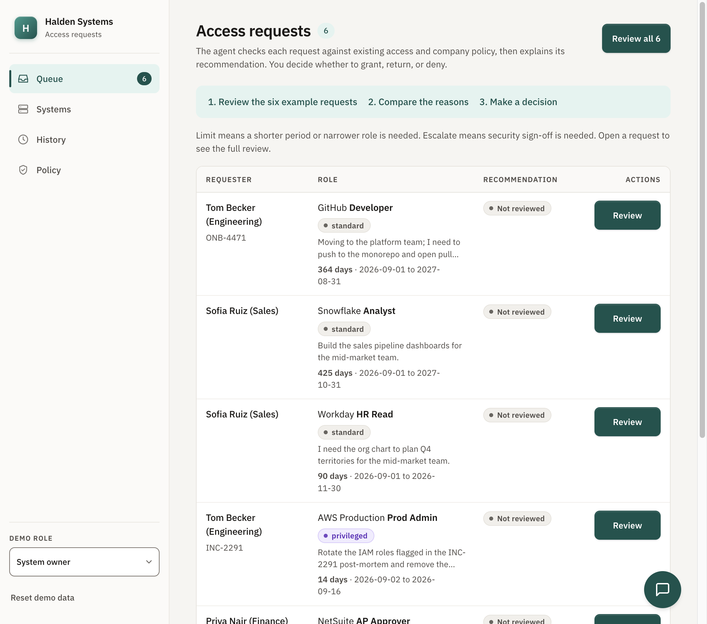

# Access Request Example



An Amodal demo for reviewing employee access requests. The agent checks
existing access, role conflicts, and duration limits, then explains its
recommendation. A system owner grants, returns, or denies the request.

The template shows one complete workflow: a custom React UI, durable tools,
a reviewer subagent, a policy document, four stores, a guard hook, and evals.
It uses fictional people and systems. It does not provision real access.

## Try the demo

Deploy the template to Amodal and open the app. The examples load on first
open. The persona switch starts on **System owner**.

1. Choose **Review all 6**. Each row shows the recommendation and its reason.
   Compare Tom's GitHub Developer request (a clean grant), Priya's AP Approver
   request (conflicts with her existing access), and Sofia's Workday request
   (more access than an org chart needs).
2. Open a request to see its justification, the four checks, existing access,
   and timeline. **Grant**, **Return**, and **Deny** require confirmation.
   The agent recommends; you decide.
3. Grant Tom's GitHub Developer request. The **Systems** page shows the
   recorded entitlement. Try granting Priya's AP Approver request: the hard
   rule blocks it. Return it with a note asking for GL Read.
4. Switch to **Priya Nair (Finance)**. Open **My requests**, edit the returned
   request, and resubmit it as NetSuite GL Read. Switch back to the system
   owner to decide on the revised request.
5. Open chat and ask `what happened to Sofia's request?` or
   `who holds Prod Admin?`. The answers come from saved records. Chat cannot
   make a human decision.
6. **Reset demo data** restores the examples for the next presentation.

**Limit** means a shorter period or narrower role is needed. **Escalate**
means security sign-off is needed. A returned request waits for its requester
to edit and resubmit; re-reviewing cannot bypass that step.

## The six cases

| Request | What it demonstrates | Recommendation |
| --- | --- | --- |
| Tom: GitHub Developer | Standard role, no conflict, 364 days | Grant |
| Priya: NetSuite AP Approver | She already holds the conflicting AP Clerk role | Deny |
| Tom: AWS Production Prod Admin | Privileged role, 14 days, incident ticket | Escalate |
| Sofia: Workday HR Read | Compensation and personal data are broader than her stated need | Limit |
| Sofia: Snowflake Analyst | 425 days against a 365-day limit | Limit |
| Tom: GitHub Developer, resent | An earlier request for the same role is still open | Deny |

The duration case demonstrates a rule evaluated in code. The Workday case
demonstrates judgment: the dates and access checks pass, but the role is
broader than the stated purpose. Ten decided requests also populate History,
Systems, and My requests so the demo opens with useful context.

## How it works

```text
Request → code checks → reviewer subagent → saved recommendation → human decision
                                                                   ↓
                                                        entitlement + history
```

| Piece | Responsibility | Main files |
| --- | --- | --- |
| Request form | Validate and save a request; review it in the same run | [submit.ts](amodal/_lib/submit.ts), [Submit.tsx](src/screens/Submit.tsx) |
| Code checks | Catalog, role conflicts, existing access, duplicates, valid dates, duration | [access-review.ts](amodal/_lib/access-review.ts), [policy.ts](amodal/_lib/policy.ts) |
| Reviewer | Judge the justification, role scope, and need for sign-off | [AGENT.md](agents/access-reviewer/AGENT.md), [access-policy.md](amodal/knowledge/access-policy.md) |
| Human decision | Re-check grant blockers, record the decision, and add the demo entitlement | [decide_request](amodal/tools/decide_request/handler.ts) |
| Guard hook | Backstop role conflicts and valid request durations for other writers | [access-guard](hooks/access-guard/index.mjs) |
| Stores | Requests, entitlements, one review per run, and action history | [amodal/stores](amodal/stores) |

The UI writes through `useToolRun` and durable tools with an `invoke` trigger.
Each tool declares its store and subagent dependencies in `uses`.
`review_request` also handles the chat command `review <request_id>`.
The reviewer calls `access_math` for duration arithmetic; code clamps its
recommendation to the minimum the facts require. Invalid structured output
is rejected before a review is saved.

The runtime cannot read a tool run's own uncommitted writes. Submission and
first-use seeding pass their rows directly into the shared review flow.
If the review fails after submission, the UI retains the saved request and
shows how to retry its review without submitting a duplicate.

A decision requires a reviewed request. Granting re-checks the hard rules;
returning requires a note, and granting an escalated request requires a
sign-off note. Each action records who did it. Previous reviews remain in
the timeline. Grants and denials cannot be reopened by the review tool.

## Read the demo through an API

The app serves [OpenAPI 3.0.3](public/openapi.json) at `/openapi.json`.
It describes existing runtime endpoints for listing and reading requests
and entitlements. No separate API server is needed.

See [API usage](docs/api.md) for authenticated requests and a native Amodal
connection that discovers this contract from another agent. This exercises
Cloud's `/openapi.json` path against the same records the UI displays.

## Develop locally

```sh
npm install
npm run dev
npm test
npm run typecheck
npm run build
```

Vite serves the UI and proxies runtime requests to `VITE_RUNTIME_URL`, which
defaults to `http://localhost:3001`. A running Amodal runtime is required for
the stores, tools, and chat. The production build includes the UI and
`openapi.json` in `dist/`. No lint script is configured.

`npm test` covers the deterministic checks, review and decision lifecycle,
submission recovery, seed and reset behavior, guard hook, routes, UI state,
confirmation dialogs, and API contract. The ten [evals](evals) test model
recommendations, history answers, and the boundary between chat and human
decisions. Run them from the agent's **Evals** page on a fresh demo dataset.
An operator's decisions can change the facts the cases depend on.

## Adapt the template

| Change | Edit | Keep aligned |
| --- | --- | --- |
| Systems, roles, people | [catalog.ts](amodal/_lib/catalog.ts) | Hook role pairs and privileged roles; policy descriptions |
| Duration limits | [policy.ts](amodal/_lib/policy.ts) | [access-policy.md](amodal/knowledge/access-policy.md), [hook.json](hooks/access-guard/hook.json), tests and eval expectations |
| Review judgment | [Reviewer prompt](agents/access-reviewer/AGENT.md) and policy | Review fields, UI labels, evals |
| Example requests and history | [examples.ts](amodal/_lib/examples.ts) | Seed invariants and the six review evals |
| Screens and interactions | [src](src) | Reads use `useStoreQuery`; writes use `runTool` |
| Record fields | [Store schemas](amodal/stores) | Runtime and UI types, examples, and the OpenAPI contract |

Changing a numeric limit means changing all its copies. Editing only the
policy text does not change the arithmetic or the guard. Tests compare the
code and hook configuration; evals check the agent's reasoning.

The persona switch demonstrates two views of the workflow. It is not
employee authentication or tenant isolation. The chat agent's write grants
support composite tools; its prompt limits direct writes. The guard checks
visible records and cannot evaluate referenced rows a run has not committed.
The handlers enforce the complete grant rules on the rows they hold.

Provisioning, automatic expiry or revocation, identity-provider integration,
manager approval chains, and tenant scopes are outside this template.
Entitlement status is a demo snapshot, not a live expiry service. The reviewer
assesses the requested duration without treating the fictional dates as overdue.

For the detailed contracts, see [SPEC.md](SPEC.md). For the same structure in
finance, see [invoice-approval-agent](https://github.com/amodalai/invoice-approval-agent).
For Amodal's building blocks introduced one at a time, see
[amodal-demo](https://github.com/amodalai/amodal-demo).
